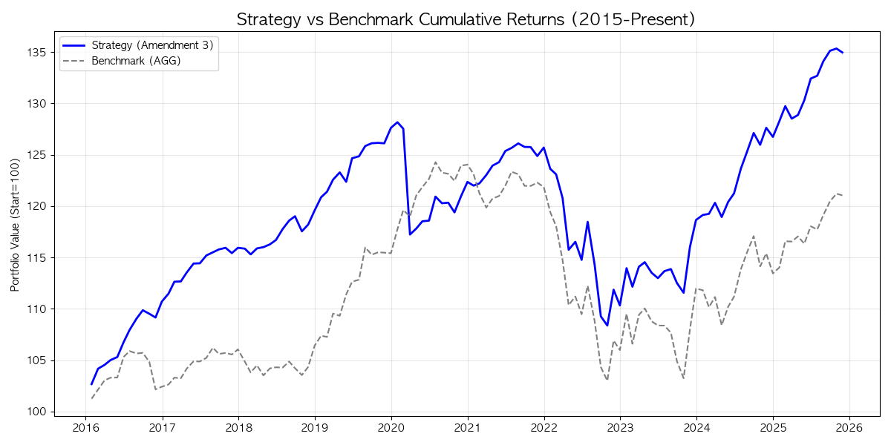
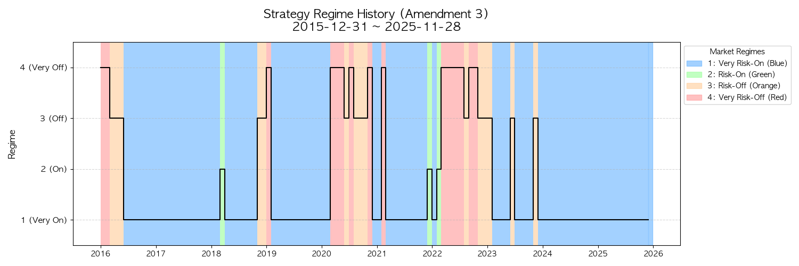
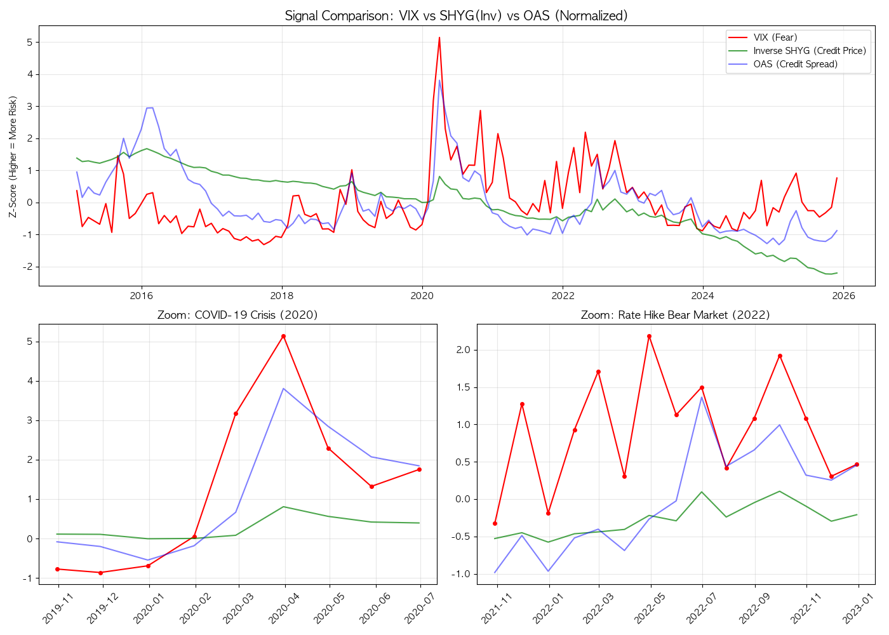

# Credit Barbell Strategy

크레딧 바벨 전략의 백테스트와 VIX 필터 확장 버전을 정리한 저장소입니다. GitHub에는 분석 초안 전체를 올리지 않고, 최종 노트북 1개와 결과물 중심으로 보이도록 구조를 정리했습니다.

## Repository Structure

```text
.
├── credit-barbell-strategy.ipynb
├── data/
├── results/
│   ├── figures/
│   └── reports/
└── README.md
```

- `credit-barbell-strategy.ipynb`
  최종 분석 노트북입니다. 기존 `바벨_VIX_추가.ipynb`를 GitHub 업로드용 이름으로 정리했습니다.
- `data/`
  원천 데이터, 중간 가공 데이터, API로 내려받은 파일을 두는 폴더입니다.
- `results/figures/`
  백테스트 성과 차트와 시각화 결과입니다.
- `results/reports/`
  월별 상세 성과표, 전략 비교 리포트, 레짐별 성과표입니다.

## Strategy Overview

이 전략은 크레딧 자산과 안전자산을 조합하는 바벨 구조를 기반으로 하며, 매크로 및 신용 스프레드 신호에 VIX 필터를 추가해 위험 국면을 보수적으로 관리하는 것을 목표로 합니다.

핵심 아이디어는 다음과 같습니다.

- 크레딧 자산과 안전자산을 함께 보유해 수익성과 방어력을 동시에 추구
- 레짐 신호를 이용해 위험 선호와 위험 회피 구간을 구분
- VIX 신호를 추가해 급격한 변동성 확대 구간에서 방어적으로 대응
- 결과는 누적성과, 레짐 타임라인, 월별 리포트로 검증

## Main Outputs

### Backtest Performance



### Regime Timeline



### VIX Signal Comparison



## Result Files

- `results/reports/strategy_VIX_TLT_mix_report.xlsx`
  전략 성과 요약 리포트
- `results/reports/strategy_monthly_details.xlsx`
  월별 수익률 및 상세 결과
- `results/reports/barbell전략_레짐별 비중과 성과_SAA.xlsx`
  레짐별 비중과 성과 정리

## Data And Dependencies

노트북은 외부 데이터 소스를 사용합니다.

- `yfinance`
  ETF 가격 및 VIX 데이터
- `fredapi` 또는 FRED 연동 패키지
  매크로/신용 관련 시계열
- `pandas`, `numpy`, `matplotlib`
  전처리 및 시각화

예시 설치 패키지:

```bash
pip install pandas numpy matplotlib yfinance fredapi openpyxl jupyter
```

## How To Run

1. 가상환경을 준비합니다.
2. 필요한 패키지를 설치합니다.
3. FRED API Key가 필요하면 환경변수 또는 노트북 설정 셀에 입력합니다.
4. `credit-barbell-strategy.ipynb`를 열어 위에서 아래 순서대로 실행합니다.
5. 결과 차트와 엑셀 파일은 `results/` 폴더에 저장하거나 갱신합니다.

## GitHub Upload Policy

이 저장소는 GitHub 업로드 시 아래 원칙으로 관리합니다.

- 루트에는 최종 노트북과 설명 문서만 유지
- 결과물은 `results/`로 분리
- 데이터는 `data/`에 분리
- 초안 노트북과 참고 PDF는 업로드 대상에서 제외

즉, GitHub 저장소는 발표/공유용 결과물 중심으로 유지하고, 작업 중간 산출물은 로컬 보관용으로 분리합니다.
